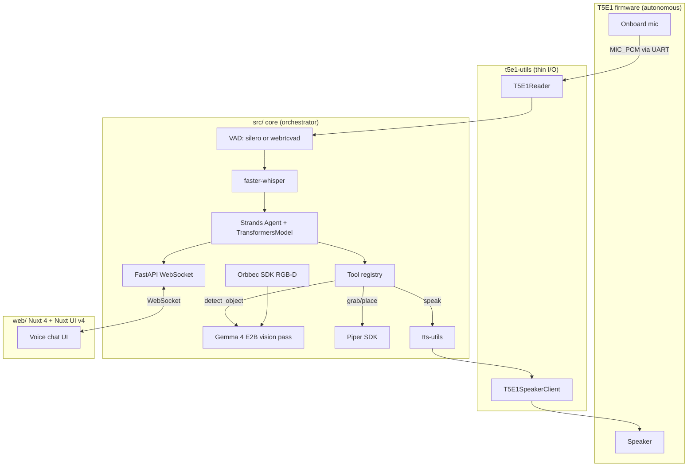

# Voice-Driven VLM Pick-and-Place — Design Spec

**Date:** 2026-05-23
**Status:** Draft for review
**Scope:** End-to-end system that takes a spoken command (T5E1 onboard mic), uses a VLM to locate target/destination objects on a tabletop, and drives an AgileX Piper arm to pick and place — orchestrated by a Strands agent with local Gemma 4 E2B for tool calling. UI is a Nuxt 4 + Nuxt UI v4 chat app modeled after `VOICECHAT-UI/index.html`.

---

## 1. Goals & non-goals

**Goals**

- Single utterance like *"pick up the strawberry and place it in the pink box"* triggers a complete pick-and-place cycle.
- Object identity is **not hardcoded** — VLM resolves arbitrary descriptions per request.
- Voice in via T5E1 onboard mic; voice out via T5E1 speaker.
- Runs entirely on one Ubuntu i7 host with a weak iGPU; no cloud APIs required.
- Browser UI shows live transcript, agent thinking, and tool status.

**Non-goals (MVP)**

- Dynamic obstacle avoidance / motion planning (fixed approach height + workspace clamp).
- Multi-object scene reasoning beyond `{action, object, destination}`.
- Persistent memory or multi-turn conversation across sessions.
- Production-grade streaming-ASR latency (utterance-batched is fine).
- Automated hand-eye calibration (one-time YAML edit).

---

## 2. Architecture

Three strict layers with a clean boundary:

```
firmware/T5E1   →   t5e1-utils   →   src/ (core)   →   web/ (Nuxt)
```

| Layer | Owns | Knows about |
|-------|------|-------------|
| **firmware/T5E1** | Mic capture, speaker playback, HST1 framing | Nothing above it |
| **t5e1-utils** | Serial I/O, HST1 read **and** write | Wire protocol only |
| **src/ core** | VAD, ASR, agent, vision, arm, web API | All Python deps; calls `t5e1-utils` |
| **web/** | Voice chat UI | WebSocket events only |

### Runtime diagram



---

## 3. Hardware & runtime assumptions

- **Compute:** Ubuntu i7 desktop, weak iGPU. Gemma 4 E2B runs on CPU (or 4-bit quant) via HF Transformers.
- **Arm:** AgileX Piper over SocketCAN (`can0` @ 1 Mbps), USB CAN dongle on `gs_usb` — matches `demos/piper_move_joint.py`.
- **Camera:** Orbbec RGB-D (Gemini 330 series) on USB; Orbbec SDK v1/v2 directly, **no ROS**.
- **Voice I/O:** Tuya T5E1 board with onboard mic and speaker; HST1 over UART2 @ 921600 baud (pins 40 RX / 41 TX).
- **Dev:** macOS for authoring; everything runs on the Ubuntu host.

---

## 4. Voice pipeline

### 4.1 Firmware (autonomous capture)

`firmware/T5E1` extended so that, in addition to existing speaker playback, it:

1. Captures mic samples via `tdl_audio` record path at 16 kHz mono 16-bit PCM.
2. Wraps them in HST1 `MIC_PCM` packets (already in `packet_schema.h`; meta = `{sample_rate_hz, channels, bits_per_sample}`).
3. Emits them continuously over UART2 TX (`host_uart_export`) — host pulls bytes off the serial port.
4. Continues to accept inbound `MIC_PCM` for speaker playback as today.

Board is the source of truth for mic state — it always streams. The host filters/gates.

### 4.2 `t5e1-utils` (passive reader)

New additions, pure protocol — no business logic:

| API | Purpose |
|-----|---------|
| `unpack_packet(buf) -> (PacketHeader, payload)` | Parse one HST1 frame, validate magic + CRC32 |
| `parse_mic_pcm_payload(payload) -> MicPcmChunk` | Split meta from samples |
| `class T5E1Reader` | Open serial; iterator / async generator yielding typed events (`MicPcmChunk`, `HealthEvent`, `SpeakerEvent`) |

`T5E1SpeakerClient` stays as-is. Reader and writer may share one `serial.Serial` via a reader/writer split, or use two ports during MVP — depends on board wiring, API is independent either way.

### 4.3 Voice pipeline in core

- **VAD:** `silero-vad` or `webrtcvad` on a sliding PCM window from `T5E1Reader`. Emits `(speech_start, speech_end)`.
- **ASR:** `faster-whisper` (`base` or `small`, int8 CPU). Transcribes after VAD end.
- Output: `Transcript(text, t_start, t_end)` published to the agent and WebSocket.

---

## 5. Agent layer

### 5.1 Stack: Strands + custom TransformersModel

Use the existing `TransformersModel` adapter from `myagent-core` (`projects/myagent/core/src/myagent_core/plugins/transformers_model.py`) as the Strands backend. Pull `myagent-core` in via a UV path source — we only need the adapter; robot tools live in `hackstorm`.

```python
from strands import Agent
from myagent_core.plugins.transformers_model import TransformersModel

model = TransformersModel(
    model_id="google/gemma-4-E2B-it",
    device="cpu",
    max_new_tokens=512,
    load_in_4bit=True,
)
agent = Agent(model=model, system_prompt=ROBOT_SYSTEM_PROMPT, tools=ROBOT_TOOLS)
```

Why this fits:

- Gemma 4 native tool tokens parsed via HF `get_tool_call_config`; JSON-in-prompt fallback already in the adapter.
- Streaming `StreamEvent`s map cleanly to WebSocket `agent_delta` events.
- Adapter's `_LOADED` cache → one Gemma load per process.

### 5.2 Tool registry

Strands `@tool` decorator in `src/agent/tools.py`:

| Tool | Args | Returns | Notes |
|------|------|---------|-------|
| `detect_object` | `description: str` | JSON bbox list + labels | VLM pass on fresh Orbbec RGB frame |
| `get_object_3d` | `description: str` | `{x, y, z}` in arm base frame | Detect + depth + transform |
| `grab_object` | `description: str` | status string | Detect → approach → descend → close → lift |
| `place_object` | `description: str` | status string | Detect destination → move → open → retreat |
| `speak` | `text: str` | "ok" | TTS → `T5E1SpeakerClient` → board speaker; also pushed to UI |
| `go_home` | — | "ok" | Safe retreat pose; opens gripper |

Strands handles the multi-step loop natively. Hard cap: 10 tool calls per user turn.

### 5.3 System prompt sketch

> You are a robot arm assistant. The user speaks commands. You have tools to detect objects with a vision model, pick them up, and place them. Always speak a short status before each motion. If you can't find an object, ask the user to clarify. Never guess coordinates — always go through the tools.

---

## 6. Vision + 3D perception

### 6.1 Detection (generalize `src/grab_box.py`)

Refactor `grab_box.py` into `src/vision/detector.py` so the prompt is parameterized:

```python
def detect(image, description: str) -> list[BoxDetection]: ...
```

Prompt template:

> Detect the {description} in this image. Return ONLY a fenced JSON code block …

Backend: HF Transformers `image-text-to-text` with `google/gemma-4-E2B-it`. Same model id as the agent — two inference paths, one weights download. MVP accepts the memory cost of loading two pipelines.

### 6.2 RGB-D capture (Orbbec SDK, no ROS)

`src/perception/orbbec_camera.py` wraps the Orbbec SDK:

- Open pipeline, enable color + depth, **align depth to color**.
- `capture() -> Frame(color_rgb: np.ndarray, depth_mm: np.ndarray, intrinsics: ColorIntrinsics)`.
- Single-shot synchronous grab per tool call.

### 6.3 Pixel + depth → arm coordinates

```
pixel (cx, cy) + depth(cx, cy) + intrinsics  →  3D point in camera frame
                                              ↓ T_cam_to_arm  (4×4 homogeneous)
                                            3D point in arm base frame
```

- Depth sample: **median of 5×5 patch** around bbox center.
- No valid depth → fall back to workspace default Z + warn.
- `T_cam_to_arm` in `config/camera_arm.yaml` (one-time hand-eye calibration).

### 6.4 Workspace bounds

`config/workspace.yaml`:

- Safe X/Y/Z min/max in arm base frame.
- Home pose.
- Approach Z offset (default +80 mm above grasp point).
- Default move speed (30%, matches existing demo).

Every motion call clamps the target before sending to the SDK.

---

## 7. Arm control

`src/arm/piper_controller.py` builds on `demos/piper_move_joint.py`:

- Auto-detect `can0` state; only `ip link` if necessary (per AGENTS.md `--no-can-auto-init` preference when already UP).
- `EnableArm(7)` once at startup; verify enable status before motion.
- Piper SDK Cartesian end-pose control (`EndPoseCtrl` family) streamed at ~50 Hz like the existing joint demo.
- `GripperCtrl` for open/close with effort cap.

Grasp script (parameterized by target `p` and orientation `R`):

1. `move_to(p + approach_offset)` — above target.
2. `move_to(p)` — descend.
3. `gripper.close()` — wait ~300 ms.
4. `move_to(p + retreat_offset)` — lift.

Place mirrors it (open instead of close at step 3).

Safety:

- All targets clamped to workspace bounds.
- Speed capped at 30%.
- Any SDK exception → abort → `go_home()` → open gripper if a payload was implied.

---

## 8. Web frontend (Nuxt 4 + Nuxt UI v4)

`VOICECHAT-UI/index.html` is the **visual/UX reference** — re-implemented in Nuxt, not embedded.

### 8.1 Project layout

```
web/
├── nuxt.config.ts             # @nuxt/ui v4, runtime config for WS URL
├── app/
│   ├── app.vue
│   └── layouts/
│       └── default.vue        # header / main / composer (mockup shell)
├── pages/
│   └── index.vue              # voice chat page
├── components/
│   ├── ConnectionBadge.vue    # green dot + "Connected"
│   ├── ChatThread.vue         # scrollable thread
│   ├── ChatMessage.vue        # user/agent bubble
│   ├── TypingIndicator.vue    # animated dots
│   ├── Composer.vue           # input + mic button
│   ├── MicButton.vue          # recording-state toggle
│   └── PlayButton.vue         # agent audio playback
├── composables/
│   └── useAgentSocket.ts      # reactive chat state from WebSocket
└── types/
    └── events.ts              # WS message discriminated union
```

### 8.2 Mockup → component mapping

| Mockup element | Nuxt component | Nuxt UI v4 primitive |
|----------------|----------------|----------------------|
| Header brand + conn dot | `ConnectionBadge` in layout | `UBadge` (color via status) |
| `.chat-thread` | `ChatThread` | plain scroll container |
| `.msg.user .bubble` | `<ChatMessage role="user">` | styled wrapper |
| `.msg.agent .bubble` + play | `<ChatMessage role="agent">` | composes `PlayButton` |
| `.typing` | `TypingIndicator` | CSS animation |
| `.composer-input-wrap` + input | `Composer` | `UInput` |
| `.btn-mic` | `MicButton` | `UButton` with `data-recording` state |
| `.play-btn` | `PlayButton` | `UButton` `icon` w/ play/pause swap |

Visual tokens (colors, radii, spacing) from the mockup's `:root` map to Nuxt UI v4 theme overrides in `app.config.ts`.

### 8.3 Mic button semantics

Firmware always streams mic to the host. The mic button is **UI state only**:

- Default: agent ignores VAD speech.
- Tap mic → UI "Listening… tap mic again to send" → backend enables VAD → ASR → agent path.
- Next utterance end → transcript appears as user bubble; agent runs.
- Tap mic again (or after agent reply) → idle (VAD still runs but transcripts discarded).

Text input is the **dev fallback** when the board isn't connected — sends `{type: "text", content: ...}` directly to the agent.

### 8.4 WebSocket protocol

`ws://<host>:8000/ws/agent` — bidirectional.

Server → client:

```typescript
type ServerEvent =
  | { type: "connected" }
  | { type: "listening"; active: boolean }
  | { type: "transcript"; role: "user"; text: string; ts: number }
  | { type: "agent_delta"; text: string }
  | { type: "agent_message"; text: string; audio_url?: string }
  | { type: "tool_status"; tool: string; status: "running" | "ok" | "error"; detail?: string }
  | { type: "thinking"; active: boolean }
  | { type: "error"; message: string };
```

Client → server:

```typescript
type ClientEvent =
  | { type: "listen_start" }
  | { type: "listen_stop" }
  | { type: "text"; content: string };
```

`agent_delta` / `agent_message` come from mapping Strands `StreamEvent` chunks produced by `TransformersModel.stream()`.

---

## 9. Core process layout

```
src/
├── core/
│   ├── main.py              # entrypoint: starts reader, agent, web server
│   ├── config.py            # workspace + camera-arm config loaders
│   └── events.py            # internal event bus types
├── voice/
│   ├── vad.py
│   └── asr.py               # faster-whisper wrapper
├── agent/
│   ├── build.py             # Strands agent factory + TransformersModel
│   ├── prompt.py            # system prompt
│   └── tools.py             # @tool definitions
├── vision/
│   └── detector.py          # generalized from grab_box.py
├── perception/
│   ├── orbbec_camera.py
│   └── frames.py            # 2D+depth → 3D + arm-frame transforms
├── arm/
│   └── piper_controller.py
└── web/
    ├── server.py            # FastAPI app + WebSocket
    └── bridge.py            # Strands events ↔ WS events
```

One process, multiple async tasks: reader, VAD/ASR worker, agent loop, web server.

---

## 10. Error handling & safety

| Failure | Response |
|---------|----------|
| T5E1 UART disconnect | Reader emits `disconnected`; UI badge red; agent disabled until reconnect |
| VAD silence after listen_start | UI hint "no speech detected" after timeout |
| Whisper empty/garbled | Pre-agent guard calls `speak("I didn't catch that")` |
| VLM no detection | Tool returns `not_found`; agent asks user to clarify via `speak` |
| Depth invalid at bbox center | Median-filter patch; fall back to workspace default Z + warn |
| Multiple matches | Pick largest matching bbox; agent may ask to confirm |
| Arm SDK exception | Abort motion, `go_home`, open gripper, surface error to UI |
| Agent tool-call runaway | Hard cap 10 tool calls / user turn |
| Workspace bounds violation | Clamp + warn; reject motion if clamp distance > threshold |

---

## 11. Dependencies

Additions to `pyproject.toml`:

| Dep | Reason |
|-----|--------|
| `strands-agents` | Agent loop |
| `myagent-core` (path) | `TransformersModel` adapter |
| `faster-whisper` | ASR |
| `silero-vad` or `webrtcvad-wheels` | VAD |
| `fastapi`, `uvicorn`, `websockets` | Web server |
| `pyorbbecsdk` (or local Orbbec SDK wheel) | RGB-D camera |
| `bitsandbytes` (optional) | 4-bit Gemma load |

Frontend (`web/package.json`):

| Dep | Reason |
|-----|--------|
| `nuxt@^4` | Framework |
| `@nuxt/ui@^4` | UI primitives |
| `@vueuse/core` | `useWebSocket`, etc. |

---

## 12. Demo flow (acceptance scenario)

1. Operator boots Ubuntu host; T5E1 powered, arm enabled, Orbbec plugged in.
2. `uv run hackstorm-serve` starts core + web (Nuxt built into `web/.output/public`).
3. Operator opens `http://localhost:8000/`, sees green "Connected".
4. Operator taps mic, says *"pick up the strawberry and put it in the pink box."*
5. UI shows: user bubble → "Agent is thinking…" → tool status pills (`detect_object: strawberry`, `grab_object: ok`, `detect_object: pink box`, `place_object: ok`) → agent bubble *"Done — placed the strawberry in the pink box."*
6. T5E1 speaker plays the same line.
7. Arm returns to home pose.

Target: **< 60 s** for one pick-and-place on the weak iGPU.

---

## 13. Out of scope (explicit)

- Custom training / fine-tuning of any model.
- Multi-object compound commands beyond one `(action, object, destination)` pair (loop technically supports more but isn't tested for it).
- Automated hand-eye calibration UI.
- Cloud fallback for vision or LLM.
- Auth on the web UI (local-only).
- Persisted chat history across browser reloads.
